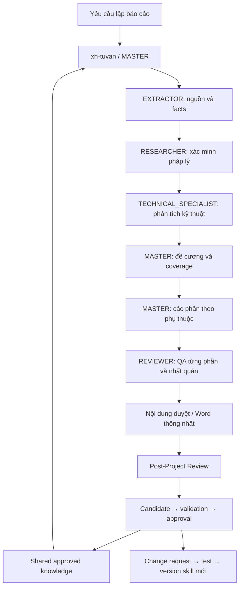

# xh-tuvan 0.8.0 — kiến trúc hai tầng

Phiên này chỉ tái cấu trúc Domain Orchestrator. Global Control chọn Master/model, ngân sách, fallback provider, worker và hạ tầng; plugin chỉ yêu cầu năng lực và quản lý nghiệp vụ báo cáo. Chưa triển khai hoặc kiểm thử kết nối Global Control thật.

Nguồn plugin và skills nằm AI_Config/PLUGINS. Shared knowledge có thể đặt AI_Workspace/SharedKnowledge/xh-tuvan qua biến XH_TUVAN_KNOWLEDGE_ROOT. Mỗi project/report có `.ai/` riêng cho facts, decisions, state, snapshot và postmortem; sources/research giữ đầu vào, drafts giữ MD từng phần, calculations giữ artifact bổ sung, outputs giữ kết quả; `.xh` lưu revision nội bộ.

Thư mục nguồn giữ tên xh-tuvan-0.6.0 để không phá đường dẫn; manifest là 0.8.0. Provider adapters/config 0.7 đã được bảo toàn trong ZIP trước di trú, gỡ khỏi runtime hiện hành. Tài liệu cũ và pack legacy chỉ là lịch sử/chuyên ngành, không được nạp policy điều phối từ đó.

Project schema 1 dùng migrate-domain: chuyển current facts/meta vào .ai, bỏ budget/execution khỏi config hoạt động, giữ snapshots và file cũ. Migrated facts cần duyệt lại và kiểm các phần stale. Không tự xóa bảng calls lịch sử nhưng runtime mới không dùng; project mới không tạo bảng này. Sao lưu project trước migrate nếu muốn quay lại chương trình 0.7.

Các cơ chế giữ lại: mapping mọi nội dung tối thiểu; không bịa số; sửa incremental, chống đè bản người dùng; dependency/revision; QA theo revision; attachments tính toán; Word một template. Shared approved knowledge khởi đầu rỗng để không tạo phê duyệt giả. Cải thiện domain sau này theo CR/test, không học tự phát từ memory model.

Giới hạn: host chịu trách nhiệm xác thực phê duyệt; semantic review không thể thay bằng các kiểm tra schema. Kết nối hai Master qua cùng store được kiểm ở mức runtime cục bộ; không phải thử end-to-end thuê bao hoặc remote. Word vẫn cần cập nhật fields và kiểm dàn trang thực tế khi giao báo cáo.
