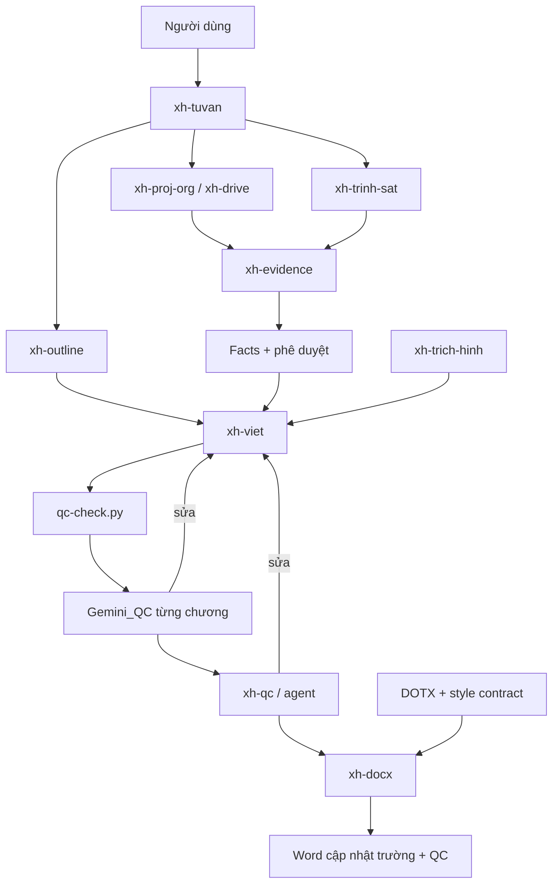

# Audit và đề xuất tối ưu xh-tuvan 0.6.0

Ngày: 07/09/2026. Trạng thái: **thiết kế để người dùng đánh giá trước implementation**.

## Phạm vi và mức độ xác minh

Đối chiếu yêu cầu trong `AI_Docs/PromptMau_Fable5.1.md` với manifest, 10 SKILL.md, agent QC, tài liệu kiến trúc, template-map và mã Python tại plugin. Có tham khảo skill, cấu hình MCP và các hàm liên quan trong ZIP `Xh llm-0.3.0-v5.zip` bên cạnh; chưa kiểm chứng đó là bản đang cài. Chưa có mã server Gemini_QC, phiên Claude Desktop, bộ dữ liệu nghiệm thu hoặc khuôn Word thật trong folder này. Không gọi provider, không dùng API trả phí, không cài plugin.

Prompt lẫn số lượng 9/10 skills; kiểm kê thực tế là **10 skills + 1 agent QC**. Các con số hiệu suất trong README là tuyên bố của bản cũ, không phải kết quả đo lại. Tên model, giá và khả năng connector ghi trong mã được xem là cấu hình hiện hữu, chưa xác minh với dịch vụ hiện tại. Đây là audit tĩnh; không chứng nhận hệ thống chạy end-to-end. Python hiện có nhưng thiếu PyYAML.

## A. Hiện trạng

Nền tảng tốt nhất đang có là phân tách dữ liệu có nguồn → Markdown → Word. `_facts.yaml` giữ giá trị và trạng thái duyệt; spec quy định nội dung; renderer chịu trách nhiệm trình bày. Quy tắc không bịa số, không tự chốt xung đột và QC tất định trước LLM cần được giữ.

Control flow hiện là hướng dẫn bằng prompt, chưa phải máy trạng thái. `xh-tuvan` suy bước làm từ sự tồn tại của `_info.yaml`, facts, spec, Markdown và DOCX. Không có bằng chứng rằng bản DOCX hiện hữu khớp phiên bản facts/spec mới nhất. Các vòng sửa do hội thoại điều khiển.

### Skill Inventory

Các input dưới đây là điều kiện theo hướng dẫn, chưa đồng nghĩa có schema được phần mềm cưỡng chế. “Claude” là mô hình chủ phiên theo thiết kế plugin; không phải kết quả đo chất lượng.

| Skill / nhóm | Mục đích, kích hoạt và trách nhiệm | Inputs | Outputs / bên nhận | Dependencies và AI | Hardcode / context | Người dùng / lỗi / vai trò tương lai |
|---|---|---|---|---|---|---|
| xh-tuvan / điều phối | Yêu cầu nhiều bước hoặc viết báo cáo; xác định bước, khởi tạo, gọi skills | Yêu cầu, `_info`, facts, spec, file hiện hữu; references chung | Cây dự án, quyết định bước; mọi skill con | Claude; toàn bộ skills; Gemini_QC bắt buộc | Cà Mau, kè/đê, schema 5 trường, quy trình chương; lặp hướng dẫn evidence/QC | Chờ duyệt spec/facts; thiếu version/resume. Essential: giữ cửa vào, chuyển state/routing khỏi prompt |
| xh-outline / thiết kế | Chưa có spec được duyệt hoặc cần đề cương | Báo cáo đã duyệt, seed tùy chọn, dữ liệu dự án, số đo văn phong | spec và exemplar → writer/QC | python-docx, do-muc-h.py; Claude suy luận mục tiêu | BCĐXCTĐT, 6 nhóm văn phong, luật 3 báo cáo; đọc mẫu lớn | Người duyệt spec; loại mới thiếu 3 mẫu dễ bị chặn. Essential: report-definition capability, seed thành pack tùy chọn |
| xh-viet / soạn thảo | Spec đã khóa; viết từng mục/chương | Spec, facts, profile, 1 exemplar; hướng dẫn domain khi cần | Markdown → QC/render; sửa theo findings | Claude; Gemini_QC cố định; qc-check | Mức văn phong đo từ mẫu, cả 10 chương, địa danh ví dụ; ~2.700 token là ước lượng chưa gồm toàn bộ input | Thiếu facts thì TODO/dừng; vòng QC vô hạn; chồng điều phối. Essential: writer chỉ nhận TaskPacket, không sở hữu cổng |
| xh-qc / kiểm định | Trước xuất bản hoặc phát hiện sai số trong Word | Draft/DOCX, facts, rules, spec, scope, kết quả luật | Findings có trích dẫn → writer/người dùng | qc-check, agent xh-qc, tùy chọn 3 agents Claude | Tuyên bố bỏ model ngoài từ 0.3 trái cổng Gemini; toàn báo cáo ở review cuối | Chỉ báo lỗi; bỏ phiếu có thể bỏ sót lỗi thật. Essential: dịch vụ đánh giá chung với findings chuẩn |
| xh-docx / trình bày | Nội dung đã kiểm; xuất Word/sửa định dạng | Markdown, DOTX, info, facts, ảnh nếu cần | DOCX và cảnh báo → QC/người dùng | render_report.py, python-docx, Word; skill docx ngoài plugin | Nam Quốc, style map cố định; không AI để render | Word cập nhật trường; thiếu style rơi Normal. Essential: renderer nhận template contract và manifest phiên bản |
| xh-evidence / dữ liệu | Dựng/bổ sung kho số, hồ sơ nặng | Tài liệu, chỉ tiêu, facts hiện hữu; bảng nhập khi thủ công | Facts ứng viên, phiếu duyệt → outline/writer/QC | Drive/local; NotebookLM thủ công; Gemini API khi được yêu cầu | Danh mục kè/đê; policy provider nằm trong skill; gửi file nguyên cho extraction | User chốt verified/conflict; parser và schema chưa đồng nhất. Essential: dịch vụ evidence, adapter extraction riêng |
| xh-proj-org / nguồn local | Sắp xếp hồ sơ, tạo cây, đổi tên | Root, giai đoạn, inventory; tiêu chí giữ/xóa | Mapping, file được tổ chức, Excel/log → người dùng/evidence | Filesystem, rename_files.py, openpyxl; Claude phân loại | Hai hệ cây; D:\ClaudeAI; bash/mount/Windows lẫn nhau | Mapping phải được duyệt; lỗi rename/move có thể phá liên kết. Useful: storage-local + tổ chức có transaction log |
| xh-drive / nguồn remote | Chỉ khi hồ sơ nằm trên Drive | Folder ID, listing; chỉ đọc file cần chỉ tiêu | Mapping, danh mục, dữ liệu → evidence | Drive connector; phan-loai-ho-so.py; ổ đồng bộ cho binary | Tool/field connector cố định, G:\ ví dụ; đọc chọn lọc tốt | User duyệt move; cắt nội dung, trùng tên, không hash. Useful: storage-drive dùng chung inventory/classifier |
| xh-trich-hinh / media | Cần ảnh PDF, caption, đọc scan | PDF; spec/draft theo mô tả; ảnh EXIF/KMZ cho tác vụ phụ | Ảnh, danh mục, bản đọc → writer/docx | docling, scripts PDF/geo/detect; user xem caption | Tên Cầu Sông Đốc, Nam Quốc; detect-figures được mô tả sai vai | User chọn mặt cắt; caption nhận sai, thiếu thư viện. Useful: media capability; sửa contract trước dùng |
| xh-trinh-sat / nghiên cứu | Tìm thông tin công khai trước viết | Địa danh, nhu cầu nghiên cứu | Sổ URL/trích đoạn → evidence rồi writer | Exa MCP, ghi-ket-qua-trinh-sat.py | Bắt buộc 5 nhóm ngành thủy lợi; chỉ Exa; ghi theo tên provider | Không Exa thì dừng; không bịa kết quả. Useful: research với câu hỏi theo task và adapter khả dụng |

### Dependency map



Đây là luồng hướng dẫn, không phải graph được runtime thực thi. Dependency dùng chung: facts, spec, profile, filesystem và qc-check. Dependency gián tiếp: nguồn → facts → mọi đoạn dùng fact → QC → Word. Vòng writer–QC là vòng sửa có chủ đích, nhưng chưa giới hạn. Drive dựng facts chồng evidence; writer và tuvan cùng điều phối Gemini; schema và quy tắc xuất xứ lặp trong nhiều tài liệu. Gemini_QC là điểm nghẽn và điểm lỗi đơn làm dừng toàn luồng. Đọc toàn báo cáo cuối kỳ và truyền lại nguyên chương nhiều lần là chi phí lớn; chưa có phép đo để định lượng.

## B. Vấn đề kiến trúc có bằng chứng

1. **Hai chính sách QC trái nhau.** `skills/xh-qc/SKILL.md:66` nói không model ngoài; `xh-viet` và `xh-tuvan` bắt Gemini. Chọn chính sách dựa vào skill nào được đọc trước là không xác định.
2. **State không ràng buộc nội dung.** `skills/xh-tuvan/SKILL.md:16` kiểm file để quyết định tiến độ. Một fact đổi vẫn có thể để lại DOCX/cổng duyệt cũ được coi là hoàn tất.
3. **Kiến thức ngành lẫn core.** `xh-viet:141` yêu cầu cả 10 chương; `xh-trinh-sat` buộc 5 nhóm nghiên cứu; `qc-check.py:46` có DEFAULT_RULES ngành và `gop_rules` trộn rules mới vào bộ cũ, chưa tạo ranh giới domain sạch.
4. **Template contract chưa thực thi.** `render_report.py:61` có STYLE trong Python; CLI không nhận template-map. `_style_an_toan` rơi về Normal. `:505` bỏ file không tồn tại khỏi thứ tự render thay vì báo thiếu. Có nguy cơ xuất thiếu chương mà không biết.
5. **Evidence chưa có cổng nhập đáng tin cậy.** `evidence-gemini.py:170` ghi output trước kiểm YAML tại `:175`; parse lỗi chỉ cảnh báo, không cưỡng chế sáu trường/status. Import NotebookLM bảo vệ verified tại `:100–104` nhưng có thể thay thế conflict/unverified, không giữ đủ ứng viên cũ. Comment đầu file còn nói không ghi đè bất kỳ khóa nào.
6. **Mô tả tool lệch thực thi.** xh-trich-hinh nói detect-figures quét Markdown/spec, trong khi script dò vùng hình PDF. Cần contract tests cho ví dụ gọi tool; mô tả tốt không thay thế được giao diện chạy thật.
7. **Không có ngân sách/vòng dừng chung.** Vòng “lặp tới khi đạt” không giới hạn attempt, cost hoặc thời gian; chưa tách provider failure khỏi semantic failure.
8. **Human edits chưa có lineage.** Cặp `_claude`/`_dasua` và learn-from-edits hữu ích cho học văn phong, nhưng không xác định revision hiện hành, vô hiệu hóa downstream hoặc approval theo hash.

### Giá trị tái sử dụng từ xh-llm

ZIP đã có ds_index/list/search/get, facts_get/add, gpt_write/qc, gemini_extract/to_markdown/review, usage_report và xh_status. Nên tận dụng retrieval theo chunk và usage log, tránh viết lại cùng chức năng trong xh-tuvan. Tuy nhiên tên tool vẫn gắn provider/vai trò. `_log_usage` dùng giá mặc định 0 cho model chưa có bảng giá: phải đổi thành unknown khi tích hợp. Markdown cạnh nguồn cần source hash để không dùng bản trích cũ sau khi nguồn đổi. Chưa coi các tool này đang available chỉ vì có ZIP.

## C. Kiến trúc đích khuyến nghị

Giữ plugin Claude hiện hữu làm giao diện. Xây **một runtime điều phối nhỏ**, một kho state theo dự án, các capability tái sử dụng và các pack có version. Không dựng hệ microservices hoặc framework nhiều agent riêng.

```text
User / 10 skill entrypoints tương thích
                 ↓
Orchestrator: plan → allocate → execute → evaluate → checkpoint
       ↙                 ↓                    ↘
Project state       Capability services       Policy / packs
Artifact lineage    evidence / research       report / domain
Approvals           outline / write / QC     style / templates
Usage / decisions   media / render           model registry
                         ↓
Execution adapters: local scripts | xh-llm MCP | Gemini_QC | manual
```

Core chỉ sở hữu task, dependency, revision, validation, approval và budget. Không chứa địa danh, chỉ tiêu kè/đê, số chương, tên khuôn hay tên model. Pack báo cáo quy định cấu trúc và gate; pack domain chứa chỉ tiêu/rules/nguồn chuẩn; profile tổ chức chứa văn phong và yêu cầu trình bày; project giữ dữ liệu riêng. Nguồn và output model là dữ liệu, không được tự thay đổi policy hay quyền chạy tool.

## D. Model allocation và adaptive execution

Registry mỗi model: ID/provider/adapter, available, modalities, context/output limits, capabilities và bằng chứng đánh giá, reliability/latency quan sát, giá input/output/cache cùng ngày hiệu lực, privacy constraints. Giá/capability chưa biết phải là unknown, không bằng 0 hoặc “tốt”. Tên model hiện hữu chỉ là config ứng viên.

TaskPacket gồm task_id, parent/section, mục tiêu, capability yêu cầu, complexity/risk, criteria, fact keys, source/chunk refs và hashes, output schema, dependency revisions, budget và deadline. Report được tách theo dependency thực tế đến section/task; không bắt buộc tách nhỏ mọi câu.

Quyết định theo thứ tự:

1. Dùng script nếu kiểm/tính/trích cấu trúc tất định đủ đáp ứng.
2. Lọc model theo tool có thật, quyền dữ liệu, modality, context, chất lượng tối thiểu và ngân sách.
3. Trong nhóm đạt chuẩn, xếp theo utility: chất lượng/reliability trừ chi phí, latency và bất định. Trọng số thuộc policy được version hóa; không đóng vai cố định cho provider.
4. Một author là mặc định. QC tất định và evidence coverage luôn theo yêu cầu task; independent review khi risk/criteria đòi hỏi. Model tự nói “tự tin” không đủ để qua cổng.
5. Review trả issue ID, severity, quote, source refs, proposed action. Sửa chỉ task liên quan. Reviewer độc lập về context; khác model/provider khi cần và có bằng chứng lợi ích, không mặc định mọi task phải 2–3 model.
6. Timeout/quota → fallback tương đương đã đủ quyền; không có ứng viên → blocked có lý do. Output sai schema → không nhập kho, bounded retry. Sai kỹ thuật → thêm nguồn/specialist hoặc yêu cầu người dùng, không retry mù.
7. Policy ban đầu đề xuất tối đa 2 lần sửa và 1 lần fallback mỗi task, có trần token/cost tổng. Chạm trần → checkpoint để người dùng quyết định; không tự hạ gate. Các con số này là đề xuất vận hành, cần hiệu chỉnh bằng benchmark.

MCP là execution interface, không tự bảo đảm durability hoặc idempotency. Adapter phải chuẩn hóa request/result, timeout, lỗi retryable, usage và external call ID. Sau crash khi chưa biết provider đã nhận request, đánh dấu uncertain; đối soát trước khi gọi lại để tránh tính phí hai lần. NotebookLM có thể là manual adapter với request/response artifact, không giả định tự động hóa được.

## E. Tiến hóa skills

Giữ cả 10 tên ở giai đoạn chuyển đổi để tương thích thói quen. Hợp nhất logic storage/inventory của drive và proj-org, vẫn giữ hai adapter. Đưa vòng gate ở viet/tuvan/qc về orchestrator. Tách provider calls khỏi evidence/writer/research. Giữ outline, media, renderer thành capability riêng; chuyển seeds, rules, style và case dự án sang packs. Agent QC chỉ trả findings, bỏ chỉ thị thiên lệch “không có lỗi gần như luôn là rà ẩu”.

Nếu thiết kế từ đầu, không chọn đúng 10 bộ phận cố định: chọn một orchestrator, các capability và adapter. Số skill chỉ phục vụ khả năng gọi của người dùng, không quyết định kiến trúc nội bộ. Chưa cần xóa skill nào trước khi có dữ liệu sử dụng.

## F. Workspace Windows

```text
<project>/
  project.yaml                 metadata, report/profile/policy versions
  sources/                     bản nguồn hoặc manifest remote IDs/hashes
  evidence/                    candidates, facts revisions, source index
  research/                    nguồn, ngày truy cập, phạm vi áp dụng
  specs/                       report/section definitions
  drafts/                      bản làm việc hiện hành
  reviews/                     findings theo revision
  edits/                       bản người dùng gửi + bản đối chiếu
  templates/                   manifest và snapshot đã chọn
  outputs/                     draft/final theo revision
  .xh/state.sqlite             tasks, approvals, revisions, usage, events
  .xh/artifacts/               snapshot bất biến theo hash
```

Đường dẫn trong manifest tương đối với project; remote dùng adapter + file ID, không dùng tên làm danh tính. Resolver chặn vượt root, chuẩn hóa Windows case/Unicode và xử lý junction/symlink theo root được cấp. Một writer cho state; file tạm cùng volume rồi atomic replace; DB transaction ghi revision sau khi artifact đã bền vững. Crash có thể để artifact mồ côi nhưng không được đánh dấu task done với file chưa tồn tại. Không đặt SQLite chạy đồng thời qua Drive sync; đồng bộ snapshot đóng nhất quán.

Không chuyển hàng loạt hồ sơ cũ ngay: project config ánh xạ `_facts.yaml`, `00_input`, `10_content`, `20_output` sang logical roles. Giữ đường dẫn cũ hoạt động qua adapter migration.

## G. State và human-in-the-loop

Task states: pending → ready → running → evaluating → done; nhánh needs_revision, awaiting_human, blocked, failed, cancelled. Done yêu cầu output schema hợp lệ, dependency revisions khớp và gates đạt. Event log ghi actor, lý do, policy/model, input/output hashes.

Tách hai trục: origin = AI/system/human; approval = unreviewed/approved/rejected. Human-edited không đồng nghĩa human-approved. Approval tham chiếu artifact hash, approver và thời điểm. User sửa C4 tạo revision mới, giữ bản cũ; invalidate task phụ thuộc C4, summary chéo chương và render. Không chạy lại các chương độc lập. Rollback tạo sự kiện đổi current pointer, giữ lịch sử và kiểm lại dependency.

Sửa ngoài runtime: so hash trước resume, import thay đổi thành human edit. DOCX edit được giữ nguyên, trích thay đổi để người dùng đối chiếu với Markdown; không coi conversion DOCX→Markdown là round-trip không mất mát. Không ghi đè edits bằng output AI.

## H. Template intelligence

Mỗi template là file + manifest: ID/version/hash, organization, report tags, language, purpose, page settings, placeholder schema, semantic style mapping, caption strategy, renderer compatibility. Discovery quét thư mục cấu hình; đọc OOXML để xác nhận style/placeholder. Metadata suy từ file chưa đủ phải đánh dấu candidate, không tự coi hợp lệ.

Lọc điều kiện bắt buộc trước, chấm phù hợp và user preference sau. Hòa điểm hoặc thiếu metadata → trình lựa chọn cụ thể. Khuôn mới hợp lệ dùng được qua manifest, không sửa core. Khuôn mới có cấu trúc renderer chưa hỗ trợ phải báo unsupported, không âm thầm rơi Normal. Lưu template hash trong output manifest. Word field update và visual QA là gate riêng trước final.

## I. Context và token

Tái sử dụng chunk retrieval của xh-llm sau khi bổ sung hash/version. Writer nhận đúng spec, facts và exemplar cần thiết. Reviewer nhận phạm vi bị đổi, facts neo liên quan, criteria và findings cũ; khi lỗi vượt phạm vi thì mở rộng có chủ đích. Review toàn cục dùng index fact/claim/references để tìm cặp mâu thuẫn rồi đọc đoạn gốc; vẫn cho full-report review khi dependency không thể thu gọn an toàn.

Chỉ truyền reference không đủ nếu provider không đọc filesystem: adapter materialize đoạn cần dùng và ghi hash của chính payload gửi. Summary không thay bằng chứng gốc. Cache key gồm source/spec/facts/profile/policy/model versions và parameters; human edit làm cache phụ thuộc hết hiệu lực. Token budget tính cả instructions, tool payload, output và retry. Ghi usage do provider trả; thiếu usage ghi unknown. Chưa hứa tỷ lệ tiết kiệm khi chưa có baseline.

## J. Lộ trình migration và rollback

| Đợt | Thay đổi có giới hạn | Điều kiện qua | Rollback |
|---|---|---|---|
| 0 — bản này | Inventory, bằng chứng, thiết kế | Người dùng đánh giá kiến trúc trước sửa lớn | Không đổi runtime |
| 1 — contracts | Sao lưu manifest/hash; sửa schema evidence, lỗi thiếu file render, contract tool; tạo fixtures | Legacy fixtures giữ hành vi hợp lệ; lỗi thiếu input phải chặn | Khôi phục bản gốc; không đụng artifact dự án |
| 2 — state | Runtime opt-in, revision/approval/dependency; legacy path mapping | Resume, human edit, crash và stale output tests đạt | Tắt runtime; mở snapshot export tương thích |
| 3 — packs/templates | Tách domain/style/report policy; template manifest và preflight | Hai report types, hai templates; legacy rendering kiểm Word | Chọn legacy pack và renderer cũ |
| 4 — allocation | Wrapper adapter xh-llm/Gemini_QC/manual; registry; budget/retry | Fake-provider failure tests, contract tests; live smoke có credentials/quyền | Policy legacy; giữ trace và artifacts |
| 5 — tối ưu có đo | Benchmark task đơn giản/phức tạp, hiệu quả reviewer, cache | Chất lượng không giảm trên bộ chuẩn, ghi token/cost/latency thực | Pin policy/model registry phiên bản trước |

Trong implementation cần đọc đầy đủ server xh-llm bản được xác nhận triển khai và Gemini_QC, không chỉnh ZIP tham khảo như thể đó là bản live. Không đổi tên/xóa các entrypoints trước khi kiểm tra tương thích. Mọi đợt có manifest file thay đổi và hướng dẫn phục hồi.

## K. Rủi ro và kiểm nghiệm kiến trúc

Rủi ro lớn nhất là tối ưu model trước khi có state/evidence contracts: tăng số provider chỉ tăng số đường sai. Rủi ro tiếp theo là profile ngành bị mất khi tổng quát hóa, approval cũ dùng cho revision mới, schema model output không đáng tin, giá không biết bị tính 0, Word nhìn đúng XML nhưng sai trang, và provider outage gây replay tính phí. Các gate ở trên xử lý từng loại; không tuyên bố đã giải quyết bằng tài liệu này.

| Scenario theo prompt | Bằng chứng cần có khi triển khai |
|---|---|
| A — loại báo cáo mới | Thêm definition/pack, không sửa core; thiếu seed vẫn lập spec và duyệt được |
| B — provider mới | Thêm registry + adapter theo contract; skills không thay đổi; provider giao thức mới có thể cần code adapter |
| C — model tăng giá | Registry giá mới thay allocation trong quality floor; unknown không thành miễn phí |
| D — task kỹ thuật khó | Risk policy kích hoạt specialist/review, có giới hạn budget |
| E — văn xuôi đơn giản | Một author hoặc xử lý tất định; không reviewer dư thừa |
| F — user sửa C4 | Hash đổi; downstream stale; bản human không bị ghi đè |
| G — provider fail | Fallback đủ capability hoặc blocked; không task done giả |
| H — khuôn mới | Discover metadata, validate styles, chọn có lý do, render kiểm Word |
| I — 15 chương/4 khó | Phân bổ dựa task; test không chứa hằng 10 chương |
| J — resume sau vài ngày | Kiểm input/policy/artifact revisions; tiếp tục task hợp lệ, không lặp call chưa đối soát |

Đây là acceptance plan, **chưa phải 10 bài test đã chạy**. Ngoài ra cần test conflict preservation, schema sai, thiếu chương, hết budget, path traversal, crash khi commit, sửa DOCX ngoài hệ thống và giá/usage không biết.

## L. Khuyến nghị cuối cùng

Ưu tiên **contracts + state + packs trước dynamic model allocation**. Giữ facts → Markdown → renderer, kế thừa retrieval/usage xh-llm, tập trung policy vào một nơi. Thiết kế đáp ứng loại báo cáo/model mới bằng data và adapters, đồng thời nêu rõ giới hạn thực: format hoặc giao thức hoàn toàn mới vẫn có thể cần adapter mới. Không cần thay hết 10 skills, không cần multi-model cho mọi việc, không cần học máy để có policy tiến hóa.

Chưa sửa SKILL.md, scripts hoặc manifest vận hành. Điểm đánh giá trước implementation xuất phát từ chính prompt người dùng cung cấp: “trước khi thực hiện những thay đổi lớn, hãy cho tôi thấy bức tranh kiến trúc hiện tại, architecture đích và logic chuyển đổi để có thể đánh giá chúng trước khi implementation.”
